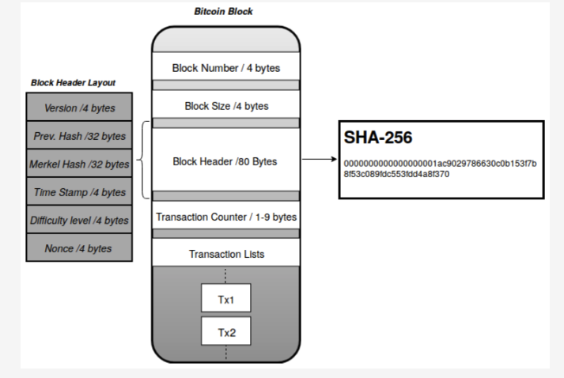
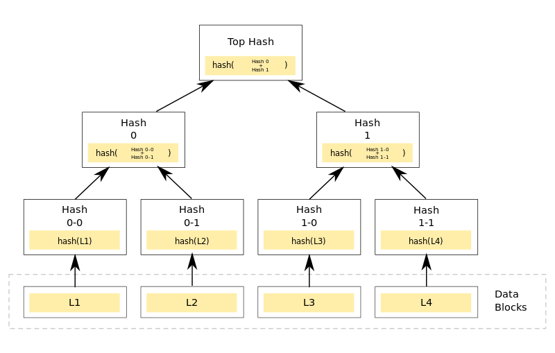

## Concepts

### Transaction

Transactions are the main reason for making blockchain so peers can send money to others, buy goods with coins, sell goods and services, and receive payments. Blockchain should be able to store and validate transactions.

#### Transaction Class

```csharp
  public class Transaction 
  {
        // This is the id of the transaction. It is calculated hashing the data in transaction.
        public string Hash { get; set; }

        // Unix timestamps or Epoch timestamps
        public long TimeStamp { get; set;  }
        
        // Address of the sender it is the public key associated with the sender
        public string Sender { get; set; }

        // Address of the recipient it is the public key associated with the recipient
        public string Recipient { get; set; }

        // Amount is send
        public decimal Amount { get; set; }
        
        // Fee (cost) associated with this transaction
        public decimal Fee { get; set; }
  }
```

[How can I convert a Unix timestamp to DateTime and vice versa?](https://stackoverflow.com/questions/249760/how-can-i-convert-a-unix-timestamp-to-datetime-and-vice-versa)


### Transaction Pool

In the world of blockchain, each transaction is not processed one by one, but the transactions are accommodated in the transaction pool. Transaction pool is a temporary place before transactions are entered into a block.

#### ITransactionPool interface

```csharp
public interface ITransactionPool
{
    // All pending transactions
    IEnumerable<Transaction> Transactions { get; }
    
    // Add additional pending transaction
    void Add(Transaction transaction);

    void ClearPool();
}
```

### Block

Blockchain is a chain of data blocks. A block can be assumed as a group or batch of transactions, or a block can be considered as a page in a ledger.



#### Block Header
Block header is some data belonging to a block that is used as a unique identity of the block. The block hash was created by hashing the block header through the SHA256 algorithm. It is essentially a digital fingerprint of the block. Below is the block header class.

#### BlockHeader class

```csharp
public class BlockHeader
{
    public int Version { get; set; }
    
    // PreviousHash is the hash of the previous block.
    // For root block it will be null
    public string PreviousHash { get; set; }
    
    // The root hash of Merkle Tree (Hash Tree). 
    // The Hash Tree made from hashes of transactions in the block.
    public string MerkleRoot { get; set; }
    
    // Unix timestamps or Epoch timestamps of time of block creation
    public long TimeStamp { get; set; }
    
    // Will use constant dificulty but for now is here
    public int Difficulty { get; set; }
    
    // The creator of the block identified by the public key.
    // Validators get reward from accumulated transaction fees.
    public string Validator { get; set; }
}
```

##### Calculating MerkleRoot

Merkle root or Merkle hash is the hash of all the hashes of all transactions within a block on the blockchain network. The Merkle root, which is the top of the Merkle Tree, was discovered by Ralph Merkel in 1979.

[Merkle Tree](https://en.wikipedia.org/wiki/Merkle_tree)


#### Block class

```csharp
public class Block
{
    // The hash of the block. The hash act as the unique identity of the given      block in the blockchain.
    public string Hash { get; private set; }

    // The sequence amount of blocks.
    public long Height { get; set; }

    public BlockHeader BlockHeader { get; set; }
    
    // Transactions are collections of transactions that occur.
    // Settled transactions
    public IEnumerable<Transaction> Transactions { get; set; }
}

```
