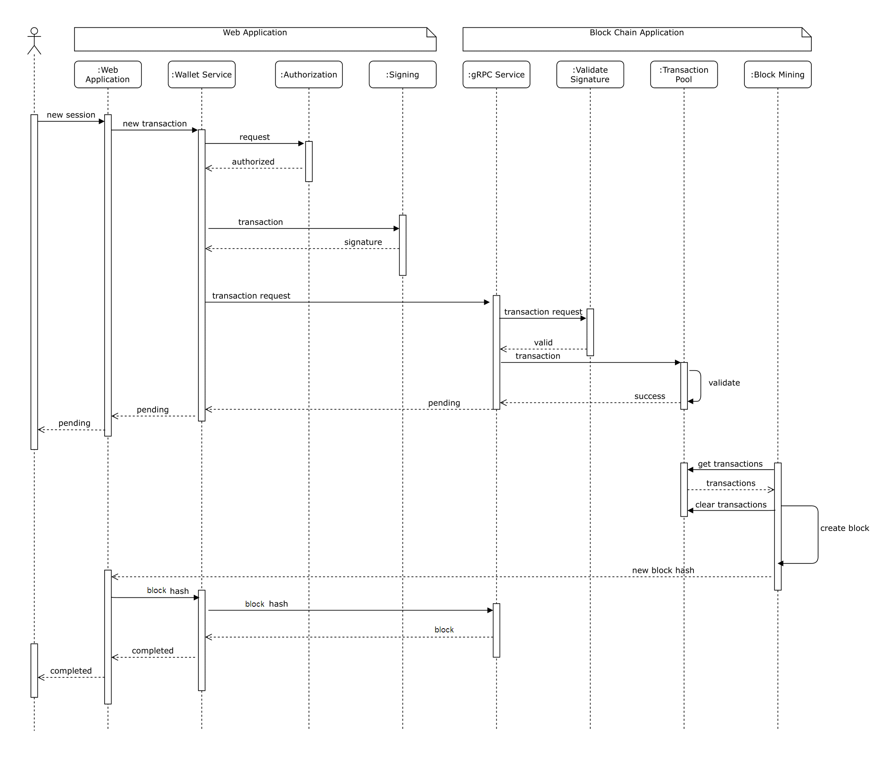

[Project_Architecture]: ./Project_Architecture.png "Logo Title Text 2"

# Block Chain Based Payment System
Payment system using block chain technology for clearing (settling) the transactions.

## Project Architecture
![Project Architecture][Project_Architecture]

## Concepts

### Transaction

Transactions are the main reason for making blockchain so peers can send money to others, buy goods with coins, sell goods and services, and receive payments. Blockchain should be able to store and validate transactions.

#### Transaction Class

```csharp
  public class Transaction 
  {
	// This is the id of the transaction. It is calculated hashing the data in transaction.
	[Key]
	public string Hash { get; set; }

	// Unix timestamps or Epoch timestamps
	public long TimeStamp { get; set; }

	// Address of the sender it is the public key associated with the sender
	public string Sender { get; set; }

	// Address of the recipient it is the public key associated with the recipient
	public string Recipient { get; set; }

	// Amount is send
	public double Amount { get; set; }

	// Fee (cost) associated with this transaction
	public double Fee { get; set; }

	public string BlockHash { get; set; }

	public Block Block { get; set; }
  }
```

[How can I convert a Unix timestamp to DateTime and vice versa?](https://stackoverflow.com/questions/249760/how-can-i-convert-a-unix-timestamp-to-datetime-and-vice-versa)


### Transaction Pool

In the world of blockchain, each transaction is not processed one by one, but the transactions are accommodated in the transaction pool. Transaction pool is a temporary place before transactions are entered into a block.

#### ITransactionPool interface

```csharp
public interface ITransactionPool
{
	/// <summary>
	/// Add new transaction to the pool.
	/// </summary>
	/// <param name="transaction"></param>
	void Add(Transaction transaction);

	/// <summary>
	/// Get all pending transactions. Once transactions are returned the transactions are cleared.
	/// </summary>
	/// <returns>All pending transactions.</returns>
	IEnumerable<Transaction> GetAll();

	/// <summary>
	/// Checks if transaction exists in transaction pool.
	/// </summary>
	/// <param name="hash">Hash of transaction.</param>
	/// <returns>true or false.</returns>
	bool Exists(string hash);
}
```

### Block

Blockchain is a chain of data blocks. A block can be assumed as a group or batch of transactions, or a block can be considered as a page in a ledger.


#### Block Header
Block header is some data belonging to a block that is used as a unique identity of the block. The block hash was created by hashing the block header through the SHA256 algorithm. It is essentially a digital fingerprint of the block. Below is the block header class.

#### BlockHeader class

```csharp
public class BlockHeader
{
	public int Version { get; set; }

	// PreviousHash is the hash of the previous block.
	// For root block it will be null
	public string PreviousHash { get; set; }

	// The root hash of Merkle Tree (Hash Tree).
	// The Hash Tree made from hashes of transactions in the block.
	public string MerkleRoot { get; set; }

	// Timestamps or Epoch timestamps of time of block creation
	public long TimeStamp { get; set; }

	// Will use constant difficulty but for now is here
	public int Difficulty { get; set; }

	// The creator of the block identified by the address.
	// Validators get reward from accumulated transaction fees.
	// For now it will be the Block chain app.
	public string Validator { get; set; }
}
```

##### Calculating MerkleRoot

Merkle root or Merkle hash is the hash of all the hashes of all transactions within a block on the blockchain network. The Merkle root, which is the top of the Merkle Tree, was discovered by Ralph Merkel in 1979.

[Merkle Tree](https://en.wikipedia.org/wiki/Merkle_tree)

[Merkle Tree](https://nakamoto.com/merkle-trees/)


#### Block class

```csharp
public class Block
{
	public Block()
	{
		this.BlockHeader = new BlockHeader();
		this.Transactions = new HashSet<Transaction>();
	}

	// The hash of the block. The hash act as the unique identity of the given block in the block chain.
	[Key]
	public string Hash { get; set; }

	// The sequence amount of blocks.
	public long Height { get; set; }

	public BlockHeader BlockHeader { get; set; }

	// Transactions are collections of transactions that occur.
	// Settled transactions
	public IEnumerable<Transaction> Transactions { get; set; }
}

```

### Blockchain

Blockchain is a transaction record that is shared and stored on a distributed computer, unchanged and open to the public. Blockchain stores transactions by grouping them into groups called block.

The number of transactions that can be entered into a block may not exceed the specified limit. This adds scarcity to the system.

Having a block in the blockchain occurs every certain period of time.


#### IBlockChainService interface

```csharp
public interface IBlockChainService 
{
	Task<int> Count();

	Task<Block> GetLastBlock();

	Task<Block> GetGenesisBlock();

	Task<Block> GetBlockByHash(string hash);

	Task<Block> GetBlockByHeight(long height);

	Task<IEnumerable<Block>> GetBlocks(int pageNumber, int resultPerPage);

	void AddTransaction(Transaction transaction);

	IAsyncEnumerable<Block[]> GetBlockChain(long height);

	Task<Block> MineBlock();
}
```


### Coinbase Transaction

Coinbase transactions are special transactions provided to nodes creating new blocks. Transactions contain Block rewards and accumulated transaction fees. Coinbase transactions are always at the top of the order of transactions in the block.


### Stake

According to the Proof of Stake consensus, users need to stake tokens to participate in the verification and creation of blocks in the blockchain.

#### Staker - participant in the verification and creation of blocks

```csharp
public class Staker
{
    public string Address { get; set; }

    public double Amount { get; set; }
}
```

#### IStake interface

```csharp
public interface IStake
{
    IEnumerable<Staker> Stakers { get; }
    
    void Add(string address, double amount);
    
    // Select stacker as block maker. The fees from transactions in block will go to the 'creator' of the block. Returns the address of 'creator'.
    string GetBlockValidator();
}
```

Real blockchain implementations such as bitcoin and others, use private keys, public keys, and addresses as identity or proof of ownership.

### Asymmetric Cryptography

> Public-key cryptography, or asymmetric cryptography, is a cryptographic system which uses pairs of keys: public keys (which may be known to others), and private keys (which may never be known by any except the owner). The generation of such key pairs depends on cryptographic algorithms which are based on mathematical problems termed one-way functions. Effective security requires keeping the private key private; the public key can be openly distributed without compromising security.

[Public-key cryptography](https://en.wikipedia.org/wiki/Public-key_cryptography)


How do you prove that blockchain transactions are yours? The answer is the signature. In the blockchain world, asymmetric cryptography is used to make signatures of messages (transactions) that are sent from the wallet to the server (blockchain node) and verify that the messages were sent by the original sender.


### Wallet

Blockchain wallets are digital wallets that allow users to store and manage their crypto. The wallet is a user interface that allows users to interact with a cryptocurrency node.

#### Account class

```csharp
public class Account
{
    // Can restore public and private keys. So it is equivalent to a password.
    public BigInteger SecretNumber { get; set; }
    
    // Public key can be shared.
    public string PublicKey { get; set; }
    
    // Addresses is computed from Public Key using hash function
    public string Address { get; set; }    
    
    // Private key may never be known by any except the owner
    public string PrivateKey { get; set; }
}
```

#### IWallet interface

```csharp
public interface IWallet
{
    // Signs transaction in client application. This sign will be validated on the server. It will be recived in gRPC Communication SendTransaction method in BChainService
    string CreateSignature(string transaction);
    
    Account CreateAccount();
    
    Account RestoreAccount(BigInteger secret);
    
    decimal GetBalance(string address);
    
    IEnumerable<Transaction> GetTransactionHistory(string address);
    
    bool SendTransaction(Transaction transaction);
}
```

#### IBlockExplorer interface

```csharp

public interface IBlockExplorer 
{
    Block GenesisBlock();
    
    Block LastBlock();
    
    IEnumerable<Block> GetAllBlocks(long pageNumber, int pageSize);
    
    Block GetBlock(string hash);
}

```

[ASP.NET Core SignalR .NET Client](https://docs.microsoft.com/en-us/aspnet/core/signalr/dotnet-client?view=aspnetcore-5.0&tabs=visual-studio)

## Comunication

### gRPC 

```proto
syntax = "proto3";

option csharp_namespace = "PaymentSystem.Common.GrpcService";

service ComunicationService {
	rpc GenesisBlock(EmptyRequest) returns (BlockResponse);
	rpc LastBlock(EmptyRequest) returns (BlockResponse);
	rpc GetBlockByHash(HashRequest) returns (BlockModel);
	rpc GetBlockByHeight(HeightRequest) returns (BlockModel);
	rpc GetBlocks(BlockRequest) returns (BlocksResponse);
	rpc GetBlockChain(BlockChainRequest) returns (stream BlockModel);
	rpc AddTransactionToPool(SendRequest) returns (TransactionResponse);  
}

message EmptyRequest {
}

message HashRequest {
	string hash = 1;
}

message HeightRequest {
	int64 height = 1;
}

message BlockRequest {
	int32 page_number = 1;
	int32 result_per_page = 2; 
}

message TransactionInput {
	int64 time_stamp = 1;
	string sender_address = 2;
	string signature = 3;
}

message TransactionOutput {
	string recipient_address = 1;
	double amount = 2;
	double fee = 3;
}

message BlockChainRequest {
	int64 height = 1;
}

message SendRequest {
	string transaction_id = 1;
	string public_key = 2;
	TransactionInput transaction_input = 3;
	TransactionOutput transaction_output = 4;
}

message SearchRequest {
	string query = 1;
	int32 page_number = 2;
	int32 result_per_page = 3; 
}

message TransactionModel {
	string Hash = 1;
	int64 TimeStamp = 2;
	string Sender = 3;
	string Recipient = 4;
	double Amount = 5;
	double Fee = 6;
}

message BlockHeaderModel {
	int32 Version = 1;
	string PreviousHash = 2;
	string MerkleRoot = 3;
	int64 TimeStamp = 4;
	int32 Difficulty = 5;
	string Validator = 6;
}

message BlockModel {
	string Hash = 1;
	int64 Height = 2;
	BlockHeaderModel BlockHeader = 3;
	repeated TransactionModel Transactions = 4;
}

message BlockResponse {
	BlockModel block = 1;
}

message BlocksResponse {
	repeated BlockModel blocks = 1;
}

message TransactionResponse {
	string result = 1;
}
```

### SignalR

```csharp
public interface IBlockNotificationClient
{
	Task ReceiveBlock(NotificationBlock block);
}

public interface IBlockNotificationServer
{
	Task SendBlock(NotificationBlock block);
}
```
[Build Real-time Applications with ASP.NET Core SignalR](https://www.codemag.com/article/1807061/Build-Real-time-Applications-with-ASP.NET-Core-SignalR)

[SignalR : To Send Real-time Notifications With ASP.NET Core](https://www.zealousweb.com/signalr-to-send-real-time-notifications-with-asp-net-core/)

[The Simplest Thing Possible: Creating Push Notifications with SignalR](https://www.codemag.com/article/1210071/The-Simplest-Thing-Possible-Creating-Push-Notifications-with-SignalR)

### State change comunication



#### TODOs
- Notification must be signed.
- gRPC method for gething part of block chain.
