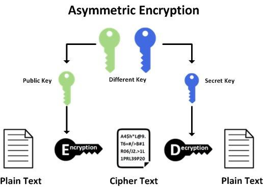
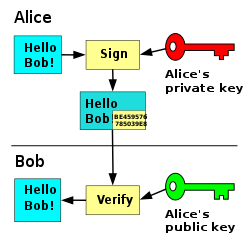

## Concepts

Real blockchain implementations such as bitcoin and others, use private keys, public keys, and addresses as identity or proof of ownership.

### Asymmetric Cryptography

> Public-key cryptography, or asymmetric cryptography, is a cryptographic system which uses pairs of keys: public keys (which may be known to others), and private keys (which may never be known by any except the owner). The generation of such key pairs depends on cryptographic algorithms which are based on mathematical problems termed one-way functions. Effective security requires keeping the private key private; the public key can be openly distributed without compromising security.

[Public-key cryptography](https://en.wikipedia.org/wiki/Public-key_cryptography)



How do you prove that blockchain transactions are yours? The answer is the signature. In the blockchain world, asymmetric cryptography is used to make signatures of messages (transactions) that are sent from the wallet to the server (blockchain node) and verify that the messages were sent by the original sender.



### Wallet

Blockchain wallets are digital wallets that allow users to store and manage their crypto. The wallet is a user interface that allows users to interact with a cryptocurrency node.

#### Account class

```
public class Account
{
    // Can restore public and private keys. So it is equivalent to a password.
    public BigInteger SecretNumber { get; set; }
    
    // Public key can be shared.
    public string PublicKey { get; set; }
    
    // Addresses is computed from Public Key using hash function
    public string Address { get; set; }    
    
    // Private key may never be known by any except the owner
    public string PrivateKey { get; set; }
}
```

#### IWallet interface

```csharp
public interface IWallet
{
    // Signs transaction in client application. This sign will be validated on the server. It will be recived in gRPC Communication SendTransaction method in BChainService
    string CreateSignature(string transaction);
    
    Account CreateAccount();
    
    Account RestoreAccount(BigInteger secret);
    
    decimal GetBalance(string address);
    
    IEnumerable<Transaction> GetTransactionHistory(string address);
    
    bool SendTransaction(Transaction transaction);
}
```

#### IBlockExplorer interface

```csharp

public interface IBlockExplorer 
{
    Block GenesisBlock();
    
    Block LastBlock();
    
    IEnumerable<Block> GetAllBlocks(long pageNumber, int pageSize);
    
    Block GetBlock(string hash);
}

```

